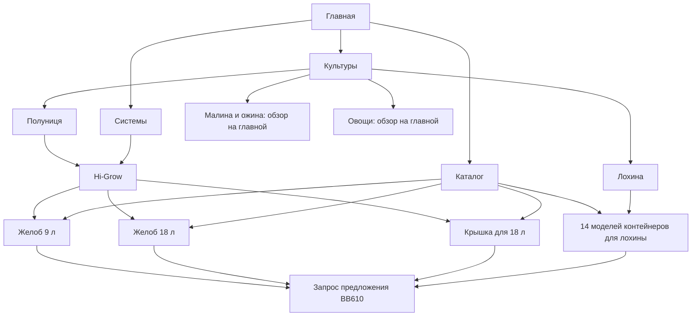

# Архитектура BB610 Garden

Основной маршрут: **главная → культура → система → компонент → запрос предложения**.

| Раздел | Адрес | Назначение |
|---|---|---|
| Главная | https://garden.bb610.com.ua/ | Обзор технологий и вход в основные разделы |
| Культуры | https://garden.bb610.com.ua/crops/ | Выбор культуры |
| Лохина | https://garden.bb610.com.ua/blueberry-production/ | Технология выращивания и 14 моделей контейнеров |
| Полуниця | https://garden.bb610.com.ua/strawberry-production/ | Система Hi-Grow, желоба и аксессуары |
| Системы | https://garden.bb610.com.ua/systems/ | Выбор комплексного решения |
| Hi-Grow | https://garden.bb610.com.ua/systems/hi-grow/ | Настольная и подвесная конфигурации, контейнеры и маты, дренаж, видео, брошюра, проекты |
| Каталог | https://garden.bb610.com.ua/catalog/ | 14 моделей для лохины, 2 желоба для клубники, крышка; переход к остальным существующим контейнерам |
| Продукт | `/portfolio-items/<модель>/` | Галерея, характеристики, совместимость, технический лист, запрос предложения |
| Технология | https://garden.bb610.com.ua/#technical-core | Инженерия корневой зоны, полива и дренажа |
| Мониторинг | https://garden.bb610.com.ua/#system-interfaces | Контроль производственной системы |
| Market | https://market.bb610.com.ua/ | Отдельное торговое направление BB610 |

## Новые карточки

- 9 л, артикул производителя 1305209: https://garden.bb610.com.ua/portfolio-items/9-liter-trough-with-truss-support/
- 18 л, артикул производителя 1305909: https://garden.bb610.com.ua/portfolio-items/18-liter-strawberry-trough-with-truss-support/
- Крышка для желоба 18 л: https://garden.bb610.com.ua/portfolio-items/trough-cover-for-strawberries/

## Правила дальнейшего развития

1. Страница культуры объясняет задачи выращивания и направляет к подходящим системам и продуктам.
2. Страница системы описывает всю установку, варианты комплектации и совместимые компоненты. Hi-Grow находится здесь, поскольку это комплексная система.
3. Карточка продукта существует в одном экземпляре и может быть связана с несколькими культурами или системами.
4. Каталог содержит отдельные продукты. Системы имеют собственный раздел.
5. Малина, ожина и овощи пока ведут в существующие обзоры на главной. Самостоятельные страницы можно добавить следующим этапом.
6. Все новые материалы оформлены на украинском языке. Запросы предложения направляются в BB610 Garden.

## Адреса и совместимость

Существующие страницы лохины сохранены. Старые ссылки `product.html?id=…` для перенесённых моделей ведут на соответствующие статические карточки, включая желоб 18 л. Адрес `/hydroponic-tabletop-strawberry-growing-system/` перенаправляет на единственную основную страницу `/systems/hi-grow/`.

Навигация обновлена на главной, в мобильном меню и на всех новых статических страницах. Добавлены canonical-адреса, метаданные, разметка Product для карточек и новые адреса в sitemap.xml.

## Техническая организация

Сайт размещается через GitHub Pages. Главная использует существующую сборку React; разделы и карточки представлены статическими HTML-страницами с общими CSS и JavaScript. Локальные изображения и PDF находятся в `media/plantlogic-blueberry/` и `media/plantlogic-strawberry/`. В `sources.json` записаны адреса исходных материалов производителя.

Проверены 23 статические страницы, 759 локальных ссылок и ресурсов, PDF и галереи. В браузере проверены переходы из культуры к системе и продукту, переключение и увеличение фотографий, мобильный вид и мобильное меню.
