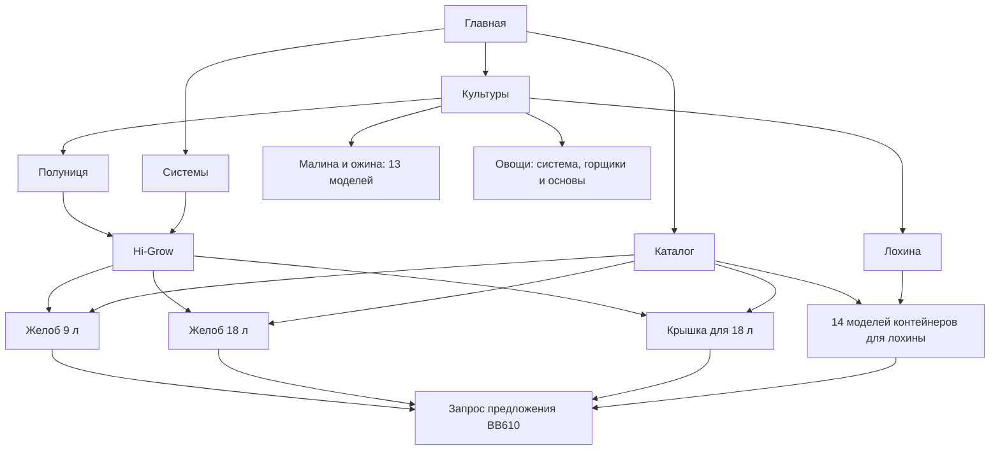

# Архитектура BB610 Garden

Основной маршрут: **главная → культура → система → компонент → запрос предложения**.

| Раздел | Адрес | Назначение |
|---|---|---|
| Главная | https://garden.bb610.com.ua/ | Обзор технологий и вход в основные разделы |
| Культуры | https://garden.bb610.com.ua/crops/ | Выбор культуры |
| Лохина | https://garden.bb610.com.ua/blueberry-production/ | Технология выращивания и 14 моделей контейнеров |
| Полуниця | https://garden.bb610.com.ua/strawberry-production/ | Система Hi-Grow, желоба и аксессуары |
| Малина и ожина | https://garden.bb610.com.ua/rubus-production/ | 13 моделей, холодное хранение, дренаж, видео и проекты |
| Овощи | https://garden.bb610.com.ua/vegetable-production/ | Овощная система, Kratos, Rivus и горщики 10/17/25 л |
| Овощная система | https://garden.bb610.com.ua/systems/vegetables/ | Опоры и подвесы, маты и желоба, отдельный дренаж, брошюра и проекты |
| Системы | https://garden.bb610.com.ua/systems/ | Выбор комплексного решения |
| Hi-Grow | https://garden.bb610.com.ua/systems/hi-grow/ | Настольная и подвесная конфигурации, контейнеры и маты, дренаж, видео, брошюра, проекты |
| Каталог | https://garden.bb610.com.ua/catalog/ | Модели для четырех культур, основы Kratos и Rivus, желоба и аксессуары |
| Продукт | `/portfolio-items/<модель>/` | Галерея, характеристики, совместимость, технический лист, запрос предложения |
| Технология | https://garden.bb610.com.ua/#technical-core | Инженерия корневой зоны, полива и дренажа |
| Мониторинг | https://garden.bb610.com.ua/#system-interfaces | Контроль производственной системы |
| Market | https://market.bb610.com.ua/ | Отдельное торговое направление BB610 |

## Новые карточки

- 9 л, артикул производителя 1305209: https://garden.bb610.com.ua/portfolio-items/9-liter-trough-with-truss-support/
- 18 л, артикул производителя 1305909: https://garden.bb610.com.ua/portfolio-items/18-liter-strawberry-trough-with-truss-support/
- Крышка для желоба 18 л: https://garden.bb610.com.ua/portfolio-items/trough-cover-for-strawberries/

## Правила дальнейшего развития

1. Страница культуры объясняет задачи выращивания и направляет к подходящим системам и продуктам.
2. Страница системы описывает всю установку, варианты комплектации и совместимые компоненты. Hi-Grow находится здесь, поскольку это комплексная система.
3. Карточка продукта существует в одном экземпляре и может быть связана с несколькими культурами или системами.
4. Каталог содержит отдельные продукты. Системы имеют собственный раздел.
5. Малина и ожина находятся в `/rubus-production/`, овощи — в `/vegetable-production/`. Овощная система имеет отдельную страницу `/systems/vegetables/`. Общие товары используются несколькими культурами без дублирования карточек.
6. Все новые материалы оформлены на украинском языке. Запросы предложения направляются в BB610 Garden.

## Адреса и совместимость

Существующие страницы лохины сохранены. Старые ссылки `product.html?id=…` для перенесённых моделей ведут на соответствующие статические карточки, включая желоб 18 л. Адрес `/hydroponic-tabletop-strawberry-growing-system/` перенаправляет на единственную основную страницу `/systems/hi-grow/`.

Навигация обновлена на главной, в мобильном меню и на всех новых статических страницах. Добавлены canonical-адреса, метаданные, разметка Product для карточек и новые адреса в sitemap.xml.

## Техническая организация

Сайт размещается через GitHub Pages. Главная использует существующую сборку React; разделы и карточки представлены статическими HTML-страницами с общими CSS и JavaScript. Локальные изображения и PDF находятся в `media/plantlogic-blueberry/` и `media/plantlogic-strawberry/`. В `sources.json` записаны адреса исходных материалов производителя.

Проверены новые и связанные статические страницы: локальные ссылки, изображения, PDF и галереи. В браузере проверены переходы из культуры к системе и продукту, переключение и увеличение фотографий, мобильный вид и мобильное меню.

## Дополнение: малина, ожина и овощи (2026-10-05)

Добавлено 18 основных страниц: 2 культуры, овощная система и 15 карточек продуктов. 13 моделей для Rubus включают существующий горщик 30 л с U-пазами. Овощной раздел использует общие карточки 10, 17, 25 и 18 л, а также Kratos и Rivus. Перенаправления `/rubus-production-2/` и `/hydroponic-tomatoes-vegetables-growing-system/` ведут на основные адреса. Локальные материалы: `media/plantlogic-rubus-vegetables/`. Страницы культур и системы используют общий дизайн и шрифты раздела «Культури».

## Аксессуары

`/accessories/` — отдельный раздел с 11 группами продуктов: 2 типа лизиметров, клипсы, желоб, кілки, анкер и защитные материалы. Доступен из общей навигации и каталога. Добавлены 10 карточек; существующая крышка используется повторно. Лизиметры Small и Large представлены вместе в `/portfolio-items/lysimeters/`, стальная модель — в `/portfolio-items/steel-lysimeter-for-blueberry-pots/`. На главной вместо чертежа ведра размещены отдельные фотографии пластикового и стального лизиметров.
